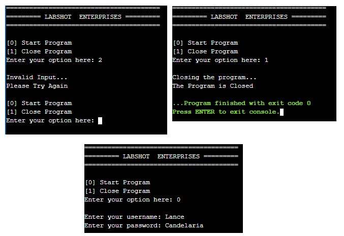

# LabShot
A simple C++ Automated Food Stall and Inventory System

This project was submitted on January 19, 2021 as a Final Project requirement during my 1st year in College.

## How to Run
Just put the whole source code in a C++ compiler. Originally, we used onlinegdb.com

## Project Objectives
The  project  focuses  on  developing  an  automated  food  stall  and  inventory  system.  This 
project lessens the time consumption and it helps to keep the record of all the daily sales of a store. 
The objective of the automated food stall is to decrease physical contact while buying sustenance, 
while the intention of having an inventory system is to lessen the caseload of a worker. This project 
can help many laborers in their works.
Specifically,
- To decrease the physical contact.
- To automate the ordering and transaction process
- To track the amount of stocks per item
- To regulate inventory automatically
- To keep records of sales.
- To reduce the cost of labor.
  

## Scope and Delimitations
The system contains the following scope:
The  system  is  written  in  C++  language  using  the  online  compiler  and  debugger  called 
OnlineGDB. The contents of this system focus solely on the software of the automated food stall 
and inventory system - meaning hardware of the said project is not included in this project. 

## Conclusion
The project focused on developing an automated food stall and storage system. This project 
lessened the time consumption and it kept the records of all the daily sales of a store. The objective 
of  the  automated  food  stall  is  to  lessen  the  physical  contact  while  buying  sustenance,  while  the 
intention of having a storage system is to lessen the caseload of a worker. The developers therefore 
conclude that all specified objectives are met based on the system.

## Recommendations
- The developers suggest using a different computer language that can execute the system 
with less memory and faster render.
- The developers suggest using third-party applications or software to improve the overall 
system.
- The developers suggest to not limit the inputs to integers, and floats only. Rather, characters 
can  also  be  inputted  but  it  will  display  that  it  can’t  recognize  character  inputs.  In  other 
words, the program will be more dynamic if inputs can be any data type.
- The developers suggest to fully implement the software online so that many people will 
have access to it.
- The developers suggest to associate the system with a functioning hardware.
- The  developers  suggest  using  a  database  so  there  will  be  a  more  efficient  data  storing 
system and for the data to be stored for a long duration.
- The developers suggest using a compiler that has more memory than the current compiler 
used.

## Program Screenshots
1. **LAUNCH OF PROGRAM & ADMIN LOGIN -** the program will ask the user to either [0] Start Program or [1] Close Program. If they chose option 1, the program will end. If option 0 was selected, it will begin the program and require an admin to login. If any other character was inputted besides 0 & 1, the output will return as invalid and will loop to the start of the program.

